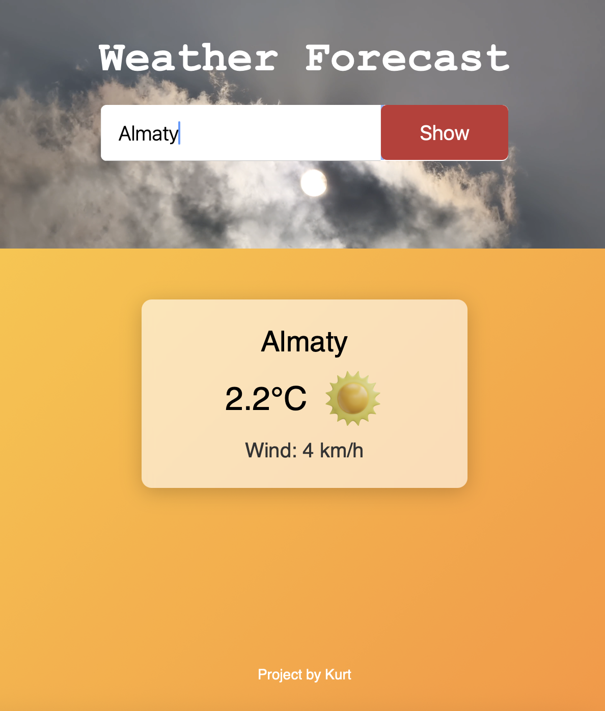
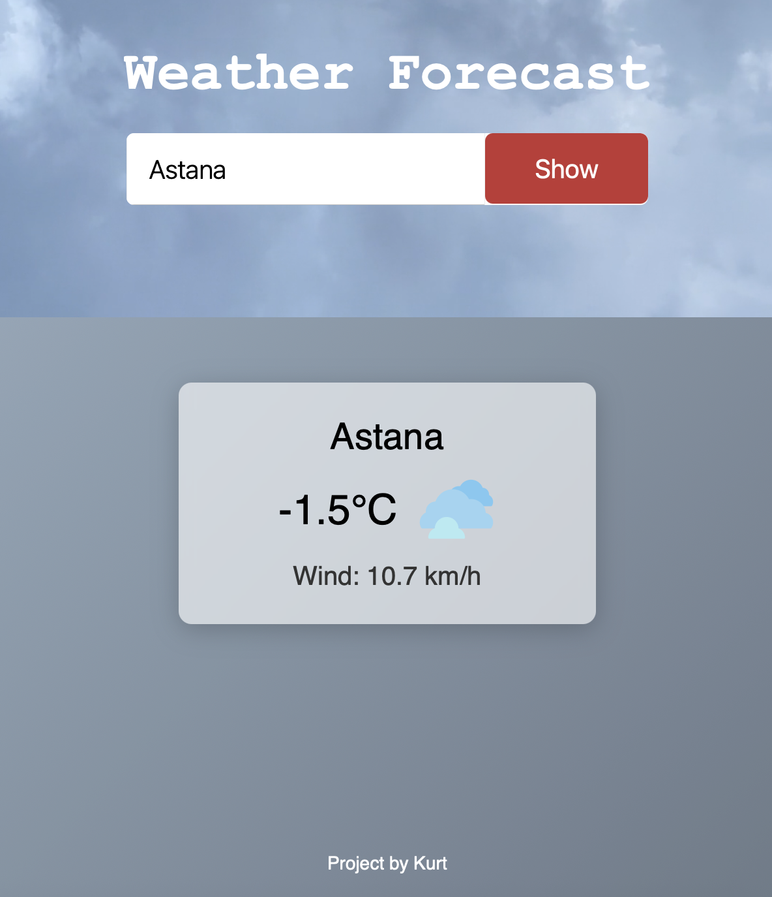
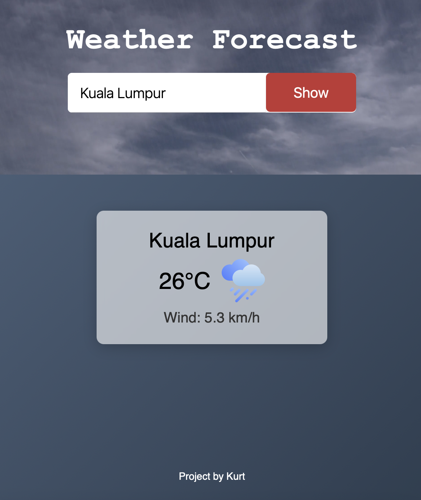
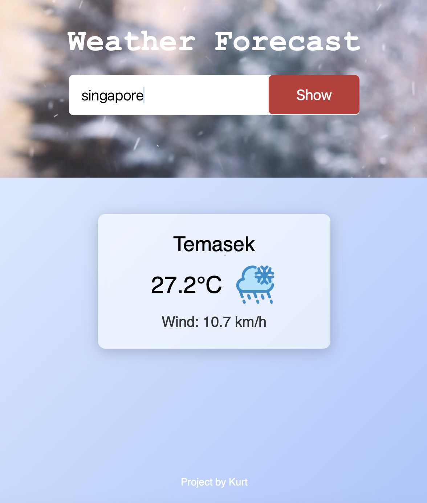

---

# Weather — Реальный прогноз погоды с динамическим видеофоном

Этот проект представляет собой клиентское веб-приложение для получения и отображения погодных данных в реальном времени. Приложение написано с нуля: от проектирования структуры и логики до реализации поиска, сетевых запросов, UI-компонентов и интерактивного видеофона, синхронизированного с текущим состоянием погоды.

---

## Цели проекта

* Создать компактное, стабильное и понятное приложение для получения прогноза погоды.
* Реализовать чистую архитектуру клиентской части.
* Отработать на практике работу с внешними API (в моем случае — OpenWeather).
* Внедрить динамический видеобэкграунд, который **не ломает** остальной функционал.
* Обеспечить полную совместимость функций, читаемость и расширяемость кода.

---

## Этапы и процессы разработки

### **1. Анализ задачи и формирование структуры проекта**

Были определены ключевые модули:

* модуль получения данных (API layer),
* модуль визуального представления (UI layer),
* логика маппинга данных (data → UI),
* модуль фонового видео.

Создана корректная структура файлов и каталогов:

```
index.html  
style.css  
script.js  
/mp4  
/img
```

---

### **2. Настройка API и проектирование сетевых запросов**

* Выделена отдельная функция `weather()` для получения прогнозов.
* Реализована обработка успешного и неуспешного ответа сервера.
* Добавлена защита от ошибок:

  * неверный город,
  * пустой запрос,
  * проблемы с сетью.
* Данные приводятся к удобному формату до передачи в рендер.

---

### **3. Разработка UI-компонентов**

Создана универсальная функция `weatherCard()`, отвечающая за визуализацию данных:

* температура,
* описание погоды,
* влажность,
* ветер,
* иконка состояния.

Принципы реализации:

* разделение ответственности,
* отсутствие дублирования,
* возможность расширить карточку новыми параметрами.

---

### **4. Реализация поиска**

Были выполнены следующие задачи:

* Обработка ввода пользователя.
* Вызов получения данных после submit.
* Очистка предыдущего результата.
* Предотвращение «двойных запросов» при повторном клике.

---

### **5. Архитектура динамического видеофона**

Это ключевая часть проекта и самая технически тонкая.

Было сделано:

* Реализована отдельная функция `updateBackgroundVideo()`.
* Функция получает тип погоды (Sunny, Cloudy, Rain, Snow) и подбирает соответствующее видео.
* Видео подгружается асинхронно, что предотвращает подвисание UI.
* Добавлены плавные переходы, чтобы не было резких смен.
* Фоновая система работает **как отдельный модуль**, не вмешиваясь:

  * в сетевые запросы,
  * в интерфейс,
  * в обновление карточки погоды.

Это обеспечивает полную совместимость — ни одна функция не ломает другую.

---

### **6. Адаптивность и визуальный дизайн**

* Проработан layout для телефона, планшета и десктопа.
* Видео фон корректно скейлится на разных устройствах.
* Контраст текста увеличен для чтения на любом фоне.
* Элементы интерфейса оптимизированы для разных DPI.

---

### **7. Документирование и финальная оптимизация**

На финальном этапе:

* удалены временные переменные,
* упрощены цепочки условий,
* проведена проверка на кроссбраузерность,
* добавлены комментарии к функциям,
* подготовлен профессиональный README.

---

## Используемые технологии

* **HTML5** — структура приложения
* **CSS3** — адаптивная стилизация, позиционирование, работа с видео
* **Vanilla JavaScript** — функциональная логика
* **Fetch API** — сетевые запросы
* **Модульная архитектура функций**
* **Видео-фон** на `<video>` или CSS background-video

---

## Архитектура проекта (высокоуровневое описание)

```
/root
│
├── index.html        # Разметка, контейнеры под данные
├── style.css         # Стили и адаптивность
├── script.js         # Логика приложения
│
├── /mp4           # Фоны по видам погоды
│     ├── sunny.mp4
│     ├── rain.mp4
│     ├── snow.mp4
│     └── cloudy.mp4
│
└── /img     # Иконки погоды
```

---

## � Принятые архитектурные решения

* Каждая функция решает одну задачу (Single Responsibility).
* UI полностью отделён от получения данных.
* Видео фон вынесен в независимый модуль.
* Все взаимодействия между функциями строго контролируются.
* Приложение легко расширить:

  * добавить прогноз на 7 дней,
  * прикрутить геолокацию,
  * сменить визуальный стиль,
  * добавить уведомления о погоде.

---

## Запуск проекта

1. Скачать или клонировать репозиторий:
2. Открыть `index.html` в браузере или запустить Live Server.
3. Вставить свой API-ключ в `script.js`:
   ```js
   const API_KEY = "ВАШ_КЛЮЧ";
   ```

---
## Скриншоты 
 
### Пример погоды — солнечно


### Пример погоды — облачно


### Пример погоды — дождь


### Пример погоды — снег



